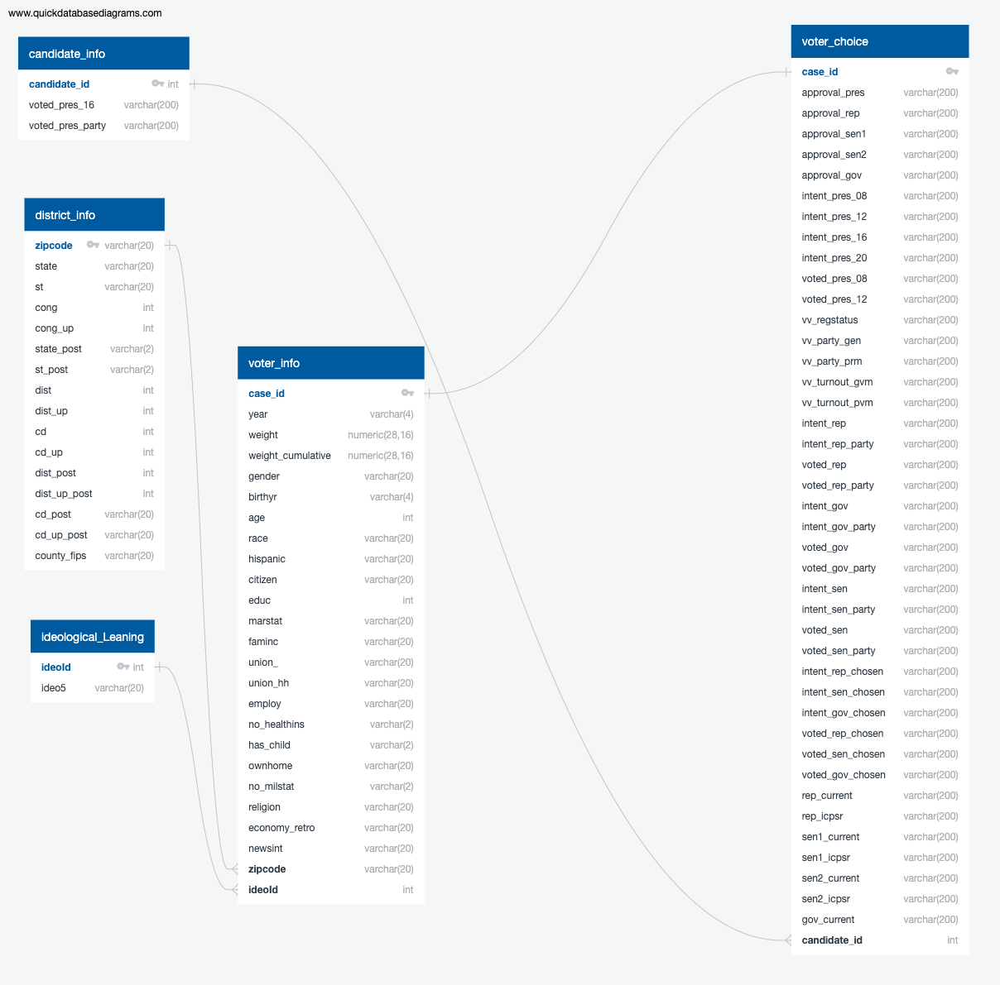

# CivicsPolitical

## Introduction

Do social characteristics and behavior predict presidential voter choice? We propose the following analysis to find out. We selected this topic because in a politically polarized society, understanding underlying drivers for political decisions may be useful in bringing about a more balanced and cooperative political culture.

## Data source

Kuriwaki, Shiro complied voter survey data in .Rds file format for the years 2006–2018. The dataframe contains 452,755 rows (observations) and 73 columns (features), including geographic, demographic, economic, news interest, political affinity, and presidential choice variables.

The data was drawn from Cooperative Congressional Election Study (CCES), one of the most comprehensive political surveys in the US.

The data set is divided then joined along the following parameters from the CSVs(find the files into the DATA folder):   

### Database Entity Relationship Diagram (ERD)

## Data Exploration

The dataframe contains election survey data going back to the year 2006. For the neural analysis we will be focusing on the year 2018, it holds 60,000 rows and 93 features. Most of the data pertains to voter information, ideological leaning, voter opinion, candidate information, voter choice. 

First the dataframe is filtered to the year 2018 and then the following variables 
For the neural analysis we will be using the following features in a new dataframe: state, district, congress (cong), year of birth (birthyr), age, education (educ), race, family income (faminc), marital status (marstat), news interest (newsint), presidential approval (approval_pres), ideology (ideo5), and lastly presidential vote (voted_pres_16). These features help assess the demographic of the voters.  

The features that are chosen are mostly categorical, so they are then turned into numeric vectors by one-hot encode. Since we want the model to predict voter’s presidential preference, the feature voted_press16 is removed from the dataframe. Note, that the voted_press16 feature consists of five categories (in accordance with the survey question structure): Voted Trump, Voted Hillary Clinton, Voted Other, Did Not Vote, and Not Sure/Don't Recall.
The remaining data is then separated into the training set which will have about 90% of data and the test set will have about 10% of the data. 

## Machine Learning Model:

### Neural Network Pros & Cons

Neural networks form the basis of DL, and applications are enormous for DL, ranging from voice recognition to cancer detection. The pros and cons of neural networks are described in this section. The pros outweigh the cons and give neural networks as the preferred modeling technique for data science, machine learning, and predictions.

**Pros**

Neural networks are flexible and can be used for both regression and classification problems. Any data which can be made numeric can be used in the model, as neural network is a mathematical model with approximation functions.
Neural networks are good to model with nonlinear data with large number of inputs; for example, images. It is reliable in an approach of tasks involving many features. It works by splitting the problem of classification into a layered network of simpler elements.
Once trained, the predictions are pretty fast.
Neural networks can be trained with any number of inputs and layers.
Neural networks work best with more data points.

**Cons**

Neural networks are black boxes, meaning we cannot know how much each independent variable is influencing the dependent variables.
It is computationally very expensive and time consuming to train with traditional CPUs.
Neural networks depend a lot on training data. This leads to the problem of over-fitting and generalization. The mode relies more on the training data and may be tuned to the data.

### Explanation of the model

For a classification model like this the Keras sequential model is used. This model is used for the task because of its simplicity to design neural networks and minimal user action. The input layer will have 12 neurons to go hand in hand with the number of features. The first activation stage will use ReLu (Rectified Linear Unit), this activation function is mostly used nowadays due to being a non-linear function and infinite gradient. The hidden layer will have 7 neurons for rule of thumb. The second activation layer will be Softmax, since the output layer will have 5 neurons due to the categorical responses in the feature. Softmax is used because it helps normalize the output and enforce it to be in a limited range. 

The defined model is now compiled with the following parameters:
Optimizer parameter is adam, used due to the volume of rows with each feature.
Loss parameter is sparse_categorical_crossentropy.

Twenty percent of the training set is then used to calculate the validation error of the model training. Now the model is fit with 500 epochs to run the algorithm and will only stop if performance doesn’t increase for 20 continuous epochs.

### Analysis

In this figure, we can see from our data that the largest share of voters, approximately 22,000 people, voted for Hilary Clinton. The second largest share of voters, approximately 19,800 people, voted for Donald Trump. Approximately 4,500 people voted for someone else other than Clinton or Trump, and less than 1,000 people did not vote. Unfortunately, a considerable portion of the data is Not Available. 

Looking at the employment status of voters, we can see that the people that voted the most were full-time eployees and retired people. Part-time workers and homemeakers ranked third and fourth, respectively. It is interesting to note that students and unemployed people have very low voting rates. This indicates that future analysis might be done to determine why certain demographics have lower voting turounout.

This figure shows the average age of people voting for each ideology. We can see that the average age of Very Conservative and Conservative voters is 55 and 53, respectively, which also seem to be the older people from our dataset. We can also observe that the younger people are, the more likely they are to be Not Sure regarding their ideology, Liberal, and Very Liberal. The average age of Moderate voters falls, as expected, between the averageage of Liberal and Conservative voters.

In this image, we can see the approval of the president based on each race.
